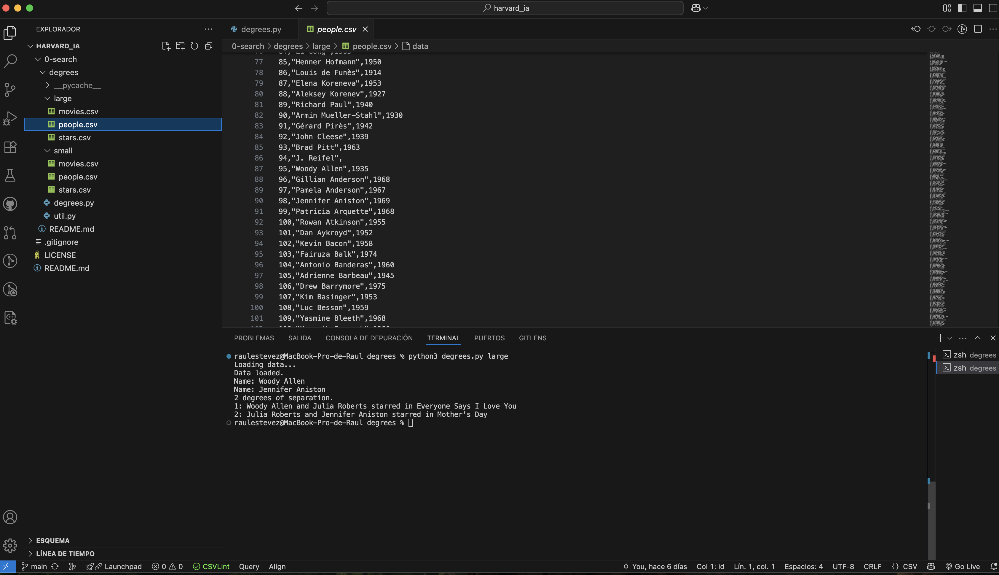

# Degrees

This project is the first exercise of the first lesson, "0 Search", from the course *CS50’s Introduction to Artificial Intelligence with Python*. 

In this exercise, a graph search algorithm is implemented to determine the shortest connection between two actors based on movies they have starred in. Inspired by the *Six Degrees of Kevin Bacon* game, it explores how closely linked two actors are within the film industry.

## How it Works

The program models actors and movies as a graph:

- Each **actor** is a node.
- Each **movie** is an edge connecting actors who appeared together.
- Using **Breadth-First Search (BFS)**, it finds the shortest path from one actor to another.

Example usage:

```
python3 degrees.py small
```

You will be prompted to enter two actor names. The program then outputs the degrees of separation and the list of movies and co-stars that connect them.

## Example Output



## Files

- `degrees.py`: Main program.
- `util.py`: Helper classes (`Node`, `QueueFrontier`) used for search.
- `small/` and `large/`: Datasets with actor/movie info in CSV format.

## Direct Access

- [**View the full source code**](./degrees.py)
- [Back to full README](../../README_en.md)

## Status

Completed and tested with both small and large datasets.

## Author

This project was completed by [**Raul Estevez**](https://raulesteveza.github.io) as part of the CS50 AI course assignments.
