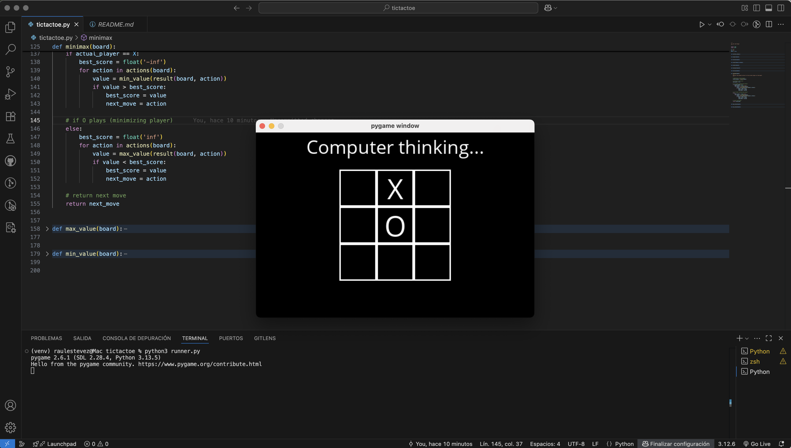

# Tic Tac Toe

Este proyecto es el segundo ejercicio de la primera lección, **"0 - Search"**, del curso *CS50’s Introduction to Artificial Intelligence with Python*.

En este ejercicio se implementa un agente de IA capaz de jugar de forma óptima al juego del Tres en Raya utilizando el **algoritmo Minimax**. La IA evalúa los movimientos posibles para garantizar que nunca pierde y siempre elige la mejor acción disponible en su turno.

## Cómo funciona

El programa simula un tablero estándar de Tres en Raya de 3x3:

- El tablero se representa como una lista bidimensional.
- El jugador actual se determina contando el número de fichas X y O existentes.
- El algoritmo `minimax` explora de forma recursiva todos los movimientos futuros posibles.
- La IA elige el movimiento con la utilidad óptima:  
  `1` si gana X, `-1` si gana O, `0` en caso de empate.

La IA juega siempre de forma óptima, asegurando el mejor resultado posible en cada turno.

Para ejecutar la interfaz gráfica:

```
python3 runner.py
```

Puedes jugar contra la IA eligiendo si quieres ser X u O.

> **Nota**: Este ejercicio prohíbe explícitamente cualquier modificación de `runner.py`.  
> Toda la lógica debe implementarse únicamente en `tictactoe.py`.

## Ejemplo de salida



## Archivos

- `tictactoe.py`: Lógica principal (estado, acciones, resultado, ganador, minimax).
- `runner.py`: Interfaz gráfica usando Pygame (no debe modificarse).
- `OpenSans-Regular.ttf`: Fuente utilizada por la interfaz gráfica.
- `requirements.txt`: Lista de paquetes necesarios de Python (principalmente `pygame`).

## Acceso directo

- [**Ver el código fuente completo**](./tictactoe.py)
- [Volver al README principal](../../README_es.md)

## Estado

Completado y probado con integración completa del algoritmo Minimax.

## Autor

Este proyecto fue realizado por [**Raul Estevez**](https://raulesteveza.github.io) como parte de los ejercicios del curso CS50 AI.
