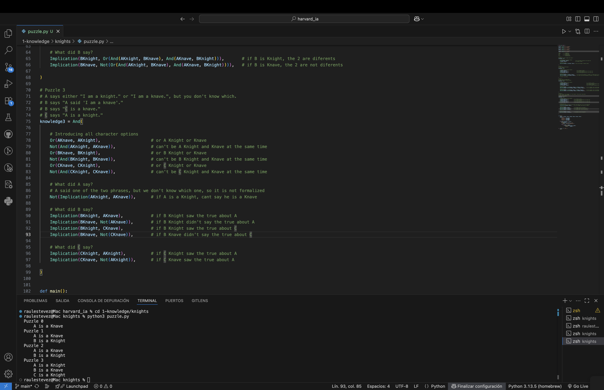

# Knights

This project is part of the course **CS50's Introduction to Artificial Intelligence with Python**, provided by Harvard University. The exercise is located within the unit on **Propositional Logic**, and its objective is to apply logical reasoning to determine the identity of different characters (Knights or Knaves).

## Project Description

In this exercise, we work with logical agents in a fictional setting. Each character is either a **Knight**, who always tells the truth, or a **Knave**, who always lies.

We are given four different scenarios, each presenting statements made by some of the characters. Using propositional logic and inference, we aim to model these situations and determine the role of each character in every puzzle.

## How to Run

To run the project, ensure you have Python 3 installed. Then execute the following command in your terminal:

```
python puzzle.py
```

This will output the deduced identities of the characters in each of the four puzzles, based on the logical knowledge defined.

## Example Output

```
Puzzle 0
    AKnave
Puzzle 1
    AKnave
    BKnight
Puzzle 2
    AKnave
    BKnight
Puzzle 3
    AKnight
    BKnave
    CKnight
```



## Files

- `logic.py`: Provided by CS50, this file contains classes and methods for logical symbols, connectives, and model checking.
- `puzzle.py`: This is the main file where the knowledge base is constructed for each puzzle and where the models are evaluated.
- `README.md`: This file.

## Direct Access

- [**View the full source code**](./puzzle.py)
- [Back to main README](../../README_en.md)

## Author

This project was completed by [**Raul Estevez**](https://raulesteveza.github.io) as part of the CS50 AI course assignments.
