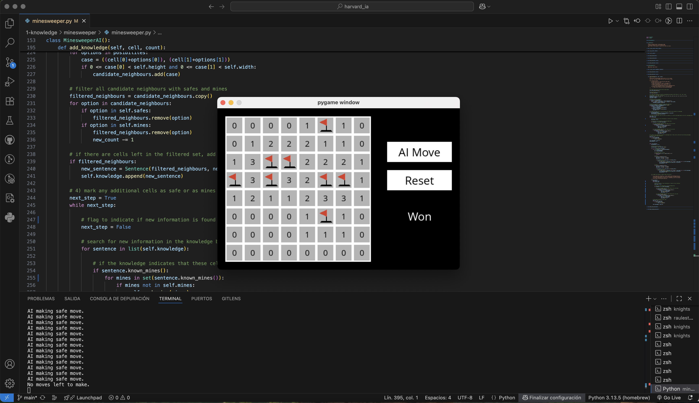

# Minesweeper

Este proyecto forma parte del curso **CS50's Introduction to Artificial Intelligence with Python**, ofrecido por la Universidad de Harvard. El ejercicio se encuentra dentro de la unidad de **Knowledge**, y su objetivo es aplicar **lógica proposicional** para modelar y resolver el juego del Buscaminas.

## Descripción del proyecto

En este ejercicio se implementa un agente de IA capaz de jugar al Buscaminas.  
La IA utiliza **inferencia lógica** para llevar un registro de las celdas que se sabe con certeza que son seguras o que contienen minas, basándose en las reglas del juego y en la información revelada tras cada movimiento.

El programa gestiona:
- **Celdas seguras conocidas** y **minas conocidas**.
- **Oraciones lógicas** que representan conjuntos de celdas y el número de minas que contienen.
- **Inferencia lógica**: deducción de nuevas celdas seguras o minas comparando oraciones y aplicando reglas de subconjuntos.
- Realización de **movimientos seguros** cuando es posible, o elección de un movimiento aleatorio cuando no hay una jugada segura garantizada.

La IA actualiza progresivamente su base de conocimiento después de cada movimiento para mejorar la toma de decisiones.

## Cómo ejecutar el programa

### 1. Clonar el repositorio
```bash
git clone <url-de-tu-repositorio>
cd <carpeta-del-repositorio>
```

### 2. Crear un entorno virtual (opcional pero recomendado)
```bash
python3 -m venv .venv
source .venv/bin/activate   # En Linux/macOS
.venv\Scripts\activate    # En Windows
```

### 3. Instalar las dependencias
```bash
pip install -r requirements.txt
```

### 4. Ejecutar el programa
```bash
python runner.py
```

Esto abrirá una ventana interactiva donde podrás ver cómo la IA juega al Buscaminas.  
La IA realiza movimientos automáticamente cuando es su turno.

## Ejemplo de salida

Al ejecutar la IA, la ventana del juego muestra el tablero actual. La IA marca las minas conocidas con banderas y revela celdas seguras, evitando las minas siempre que sea lógicamente posible.



## Archivos

- **`minesweeper.py`** → Contiene la lógica del juego y la implementación del agente de IA.
- **`runner.py`** → Lanza la interfaz gráfica y ejecuta el juego.
- **`requirements.txt`** → Lista de paquetes de Python necesarios.

## Acceso directo

- [**Ver el código fuente completo**](./minesweeper.py)
- [Volver al README principal](../../README_es.md)

## Autor

Este proyecto fue realizado por [**Raul Estevez**](https://raulesteveza.github.io) como parte de los ejercicios del curso CS50 AI.
