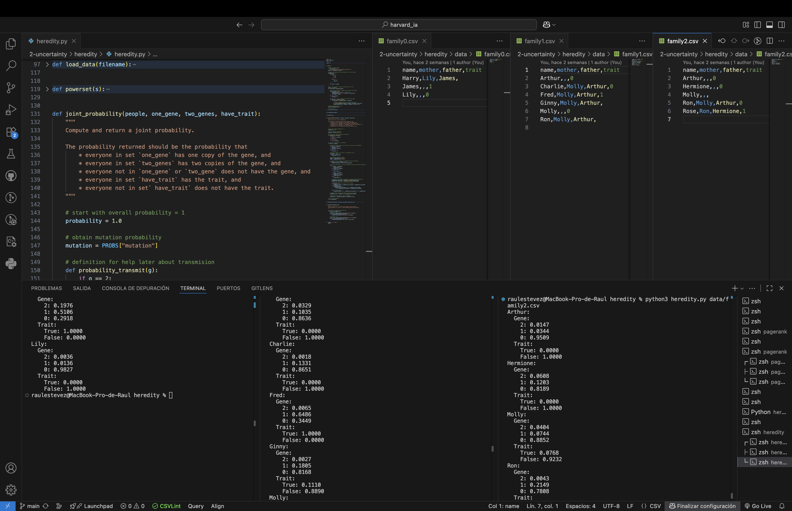

# Heredity

This project is part of the course **CS50's Introduction to Artificial Intelligence with Python**, provided by Harvard University.  
The exercise is located within the unit on **Uncertainty**, and its objective is to calculate the probabilities of people having a particular gene and exhibiting a trait, based on genetic inheritance and mutation probabilities.

## Project Description

In this project, we model how genes are passed on from parents to children, taking into account both:
- **Probabilities of inheritance**:  
  - Parents can pass 0, 1, or 2 copies of a gene to their children.
  - The chance depends on how many copies of the gene the parent has.
- **Mutation probabilities**:  
  - A gene may mutate with a given probability (1%), meaning:
    - A parent with 2 genes might fail to pass it on.
    - A parent with 0 genes might unexpectedly pass one on.

We then combine these probabilities with trait probabilities (likelihood of exhibiting a trait given the number of gene copies) to compute the **joint probability** of any configuration of the family.  
Finally, we normalize the results to obtain valid probability distributions for each individual.

## How to Run

To run the project, ensure you have **Python 3** installed.  
Execute the program with one of the CSV datasets provided:

```bash
python heredity.py family0.csv
python heredity.py family1.csv
python heredity.py family2.csv
```

The CSV file specifies the people, their parents (if known), and evidence about whether they exhibit the trait.

## Example Output

For example, running with `family0.csv` may produce:

```
Harry
  Gene:
    2: 0.0000
    1: 0.0000
    0: 1.0000
  Trait:
    True: 0.0000
    False: 1.0000

James
  Gene:
    2: 0.0100
    1: 0.0300
    0: 0.9600
  Trait:
    True: 0.0100
    False: 0.9900

Lily
  Gene:
    2: 0.1976
    1: 0.5030
    0: 0.2994
  Trait:
    True: 0.6976
    False: 0.3024
```

*(Values may vary slightly depending on floating-point precision.)*




## Files Included
- **heredity.py** → The main program implementing the algorithm.
- **family0.csv**, **family1.csv**, **family2.csv** → Sample datasets to test the program.
- **README.md** → This explanation file.

## Concepts Practiced
- Representation of probabilities using Python dictionaries.
- Computing **joint probability distributions**.
- Updating probabilities across multiple hypotheses.
- **Normalization** of probability distributions.
- Iterating over all possible combinations using `powerset`.
