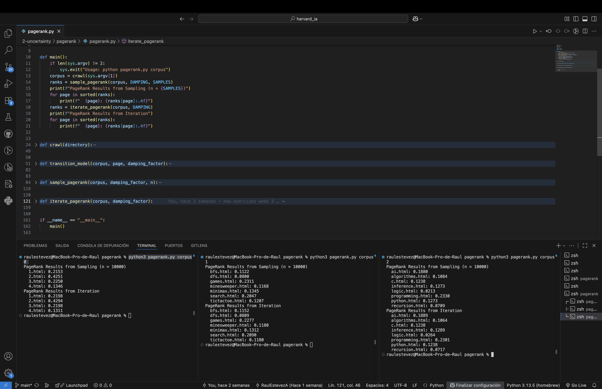

# PageRank

Este proyecto forma parte del curso **CS50's Introduction to Artificial Intelligence with Python**, ofrecido por la Universidad de Harvard.  
El ejercicio se encuentra dentro de la unidad de **Incertidumbre (Uncertainty)** y su objetivo es implementar y comparar dos métodos para calcular el **PageRank** de un conjunto de páginas web.

## Descripción del proyecto

El objetivo de este proyecto es simular y calcular el algoritmo **PageRank**, que estima la importancia relativa de cada página dentro de una red web. Se implementan dos enfoques diferentes:

### 1. Método de muestreo (Sampling)
- Se simula un **navegante aleatorio** que se mueve entre las páginas del corpus.
- Se utiliza un **modelo de transición** para decidir la probabilidad de moverse a otra página.
- Tras realizar un gran número de muestras, la distribución de visitas se aproxima a los valores de PageRank.

### 2. Método iterativo (Iteration)
- Los valores de PageRank se inicializan de forma uniforme para todas las páginas.
- En cada iteración, los valores se redistribuyen según los enlaces entrantes y el **factor de amortiguación (damping factor)**.
- El proceso continúa hasta que los valores convergen (el cambio es menor que 0.001).

Ambos métodos devuelven una **distribución de probabilidad** (diccionario), donde las claves son los nombres de las páginas y los valores representan su PageRank estimado, sumando en total 1.

## Cómo ejecutar el programa

Asegúrate de tener **Python 3** instalado.  
Ejecuta el programa indicando el corpus que deseas analizar:

```bash
python pagerank.py corpus0
python pagerank.py corpus1
python pagerank.py corpus2
```

Cada carpeta `corpus` contiene un conjunto de páginas HTML con enlaces entre ellas.

## Ejemplo de salida

```text
Resultados de PageRank por Muestreo (n = 10000)
1.html: 0.2225
2.html: 0.4250
3.html: 0.3525

Resultados de PageRank por Iteración
1.html: 0.2211
2.html: 0.4278
3.html: 0.3511
```

Los valores obtenidos por ambos métodos son similares, como era de esperar.



## Archivos incluidos

- **`pagerank.py`** → Contiene la implementación del algoritmo PageRank y las funciones auxiliares.
- **`corpus0/`** → Corpus pequeño de prueba con páginas HTML.
- **`corpus1/`** → Corpus de tamaño medio.
- **`corpus2/`** → Corpus de mayor tamaño.

## Acceso directo

- [**Ver el código fuente completo**](./pagerank.py)
- [Volver al README principal](../../README_es.md)

## Autor

Este proyecto fue realizado por [**Raul Estevez**](https://raulesteveza.github.io) como parte de los ejercicios del curso CS50 AI.
