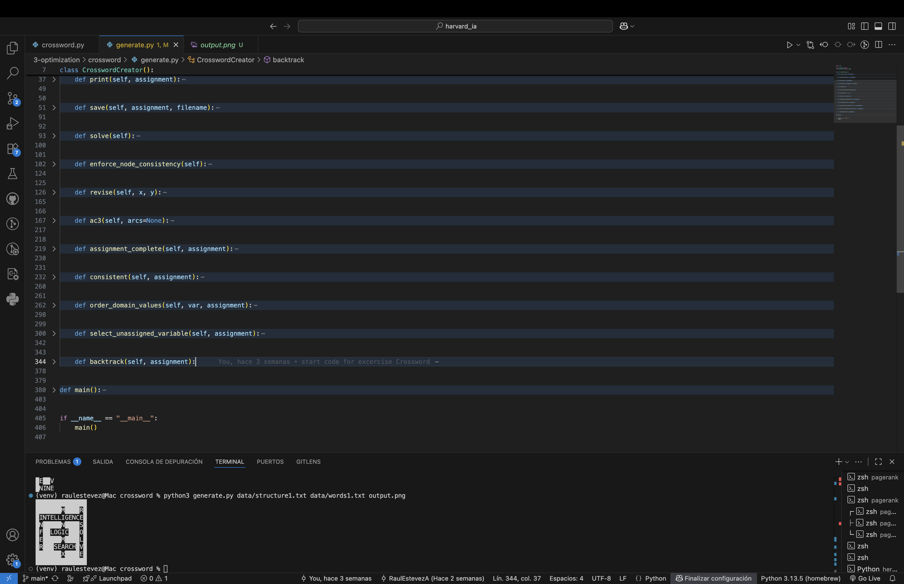

# Crossword

This project is part of the course **CS50's Introduction to Artificial Intelligence with Python**, provided by Harvard University. The exercise is located within the unit on **Optimization**, and its objective is to generate crossword puzzles by modeling them as a **Constraint Satisfaction Problem (CSP)**.

## Project Description

The goal of this project is to fill a crossword grid using a given word list, ensuring that all constraints imposed by the structure are satisfied. The problem is modeled as a CSP with the following components:

1. **Variables**
   - Each horizontal or vertical slot in the crossword is a variable.
   - Each variable has an associated length constraint.

2. **Domains**
   - The possible values for each variable are the words from the list that match its length.
   - Domains are reduced by enforcing node and arc consistency.

3. **Constraints**
   - Unary constraint: word length must match the slot length.
   - Binary constraints: overlapping variables must share the same character at the overlap position.
   - No word can be reused more than once.

To solve the problem efficiently, the program uses:
- **AC-3** to enforce arc consistency and prune domains.  
- **Heuristics**:
  - *Minimum Remaining Values (MRV)* to select variables.  
  - *Degree heuristic* to break ties by number of constraints.  
  - *Least Constraining Value (LCV)* to order candidate words.  
- **Backtracking search** to explore assignments until a valid solution is found or all options are exhausted.

The program outputs a completed crossword grid if possible, or reports when no solution exists.

## How to Run

To run the project, ensure you have Python 3 installed. Then execute the following command in your terminal:

```bash
python generate.py data/structure1.txt data/words1.txt output.png
```

- `structure1.txt` → Defines the crossword grid (with `█` for blocked cells).  
- `words1.txt` → Contains the list of words to use in the crossword.  
- `output.png` → The resulting filled crossword will be saved as an image.  

You can also print the crossword directly to the terminal by modifying the `main` function in `generate.py`.

## Example Output

```
██████████████
███████M████R█
█INTELLIGENCE█
█N█████N████S█
█F██LOGIC███O█
█E█████M████L█
█R███SEARCH█V█
███████X████E█
██████████████
```




## Files

- **`crossword.py`** → Contains the definitions for the `Crossword` class and helper methods.  
- **`generate.py`** → Implements the CSP solver, heuristics, and backtracking search to fill the crossword.  
- **`data/structure*.txt`** → Crossword structure files.  
- **`data/words*.txt`** → Word lists for testing.  

## Direct Access

- [**View the full source code**](./generate.py)  
- [Back to main README](../../README_en.md)  

## Author

This project was completed by [**Raul Estevez**](https://raulesteveza.github.io) as part of the CS50 AI course assignments.
