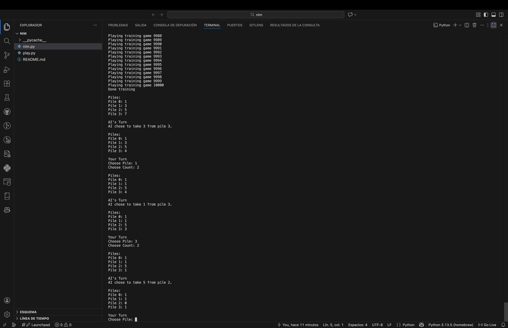

# Nim

Este proyecto forma parte del curso **CS50's Introduction to Artificial Intelligence with Python**, dentro de la unidad de **Learning (Aprendizaje)**.  
El objetivo de este ejercicio es implementar un agente de **aprendizaje por refuerzo** que aprenda a jugar al juego de Nim utilizando **Q-learning**.

## Descripción del proyecto

Nim es un juego por turnos que se juega con varios montones de objetos. En cada turno, un jugador elimina uno o más objetos de un único montón. En esta versión del juego (*misère Nim*), el jugador que retira el **último objeto pierde**.

El objetivo del proyecto es construir una IA que aprenda la estrategia óptima jugando contra sí misma de forma repetida. A lo largo de miles de partidas simuladas, la IA actualiza los valores Q para pares `(estado, acción)` y mejora progresivamente su toma de decisiones.

El programa se organiza en torno a dos clases principales:

- **`Nim`** → Implementa la lógica del juego (montones, movimientos, turnos y condiciones de victoria).
- **`NimAI`** → Implementa un agente de Q-learning que aprende a partir de la experiencia.

El proceso de aprendizaje se basa en:

- **Valores Q** almacenados como pares `(estado, acción)`.
- **Alpha (tasa de aprendizaje)** para controlar cuánto influyen las nuevas experiencias en el conocimiento existente.
- **Epsilon (tasa de exploración)** para equilibrar exploración (movimientos aleatorios) y explotación (mejor movimiento conocido).

## Cómo funciona

El proyecto consta de tres etapas principales:

1. **Definición del juego**
   - El estado actual se representa como una lista con el tamaño de cada montón.
   - Las acciones se representan como `(pile_index, objects_removed)`.
   - Se generan todas las acciones válidas para un estado dado.

2. **Entrenamiento (aprendizaje por refuerzo)**
   - La IA juega miles de partidas contra sí misma.
   - Tras cada movimiento, se actualizan los valores Q usando la fórmula de Q-learning.
   - El agente utiliza una estrategia *epsilon-greedy* para explorar acciones aleatorias ocasionalmente.

3. **Juego contra la IA**
   - Tras el entrenamiento, un jugador humano puede jugar contra el modelo aprendido.
   - Durante la partida, la IA selecciona acciones de forma codiciosa (sin exploración).

## Cómo ejecutar el programa

Asegúrate de tener **Python 3** instalado.

Para entrenar a la IA y jugar una partida, ejecuta:

```bash
python play.py
```

Por defecto, el programa entrena a la IA y, a continuación, permite jugar contra ella desde la terminal.

Puedes modificar el número de partidas de entrenamiento directamente en el código si deseas experimentar con distintos tamaños de entrenamiento.

## Ejemplo de salida

A continuación se muestra un ejemplo de la interacción en la terminal tras el entrenamiento (la salida exacta puede variar según el número de partidas y las decisiones aleatorias):

```text
Training AI for 10000 games...
Done training.

Piles:
Pile 0: 1
Pile 1: 3
Pile 2: 5
Pile 3: 7

Your turn
Choose Pile: 2
Choose Count: 3

AI's turn
AI chose to take 1 from pile 1

...
Game Over!
Winner is: AI
```



## Conceptos clave implementados

- Regla de actualización de Q-learning:

```
Q(s, a) ← Q(s, a) + α * ((reward + future_reward) − Q(s, a))
```

- Selección de acciones *epsilon-greedy*.
- Representación del estado mediante tuplas para usarlas como claves de diccionario.
- Aprendizaje por refuerzo mediante *self-play* (juego contra sí mismo).

## Archivos

- **`nim.py`** → Contiene la implementación de la lógica del juego y del agente de Q-learning (clases `Nim` y `NimAI`).
- **`play.py`** → Punto de entrada del programa. Entrena a la IA y permite jugar contra ella desde la terminal.

## Acceso directo

- [**Ver el código fuente completo**](./nim.py)  
- [Volver al README principal](../../README_es.md)

## Autor

Este proyecto fue realizado por [**Raul Estevez**](https://raulesteveza.github.io) como parte de los ejercicios del curso CS50 AI.
