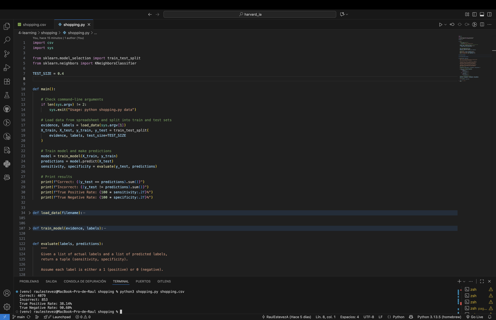

# Shopping

Este proyecto forma parte del curso **CS50's Introduction to Artificial Intelligence with Python**, ofrecido por la Universidad de Harvard.  
El ejercicio se encuentra dentro de la unidad de **Learning (Aprendizaje)** y su objetivo es predecir si un usuario generará ingresos (realizará una compra) en un sitio web de comercio electrónico, basándose en los datos de su sesión.

## Descripción del proyecto

El conjunto de datos contiene información sobre sesiones de compra online, como el número de páginas administrativas, informativas y de productos visitadas, la duración de las sesiones, tasas de rebote (*bounce rate*), tasas de salida (*exit rate*), el mes de la visita, si el usuario es un visitante recurrente y si la visita ocurrió durante un fin de semana.

El objetivo es construir un clasificador **k-nearest neighbors (k-NN)** (con `k=1`) que prediga si un usuario generará ingresos (`Revenue = TRUE`) o no (`Revenue = FALSE`).

El programa consta de tres partes principales:

1. **Carga de datos**  
   - Lee los datos desde `shopping.csv`.  
   - Convierte los valores categóricos (mes, tipo de visitante, fin de semana, ingresos) en representaciones numéricas.  
   - Genera una lista de evidencias (características) y etiquetas (resultados).  

2. **Entrenamiento del modelo**  
   - Utiliza `KNeighborsClassifier` de `scikit-learn` con `n_neighbors=1`.  
   - Entrena el modelo con una parte de los datos disponibles.  

3. **Evaluación**  
   - Prueba el modelo con datos no vistos previamente.  
   - Calcula la **sensibilidad (true positive rate)** y la **especificidad (true negative rate)**.  

## Cómo ejecutar el programa

Asegúrate de tener **Python 3** instalado junto con la librería necesaria:

```bash
pip install scikit-learn
```

A continuación, ejecuta el siguiente comando en la terminal:

```bash
python shopping.py shopping.csv
```

El programa mostrará por pantalla el número de predicciones correctas e incorrectas, así como la sensibilidad y especificidad del modelo.

## Ejemplo de salida

```
Correct: 4200
Incorrect: 800
True Positive Rate: 0.38
True Negative Rate: 0.90
```



## Archivos

- **`shopping.py`** → Contiene las implementaciones de `load_data`, `train_model` y `evaluate`.  
- **`shopping.csv`** → Conjunto de datos con información de sesiones de compra online.  
- **`shopping.png`** → Imagen de ejemplo con los resultados.  

## Acceso directo

- [**Ver el código fuente completo**](./shopping.py)  
- [Volver al README principal](../../README_es.md)  

## Autor

Este proyecto fue realizado por [**Raul Estevez**](https://raulesteveza.github.io) como parte de los ejercicios del curso CS50 AI.
