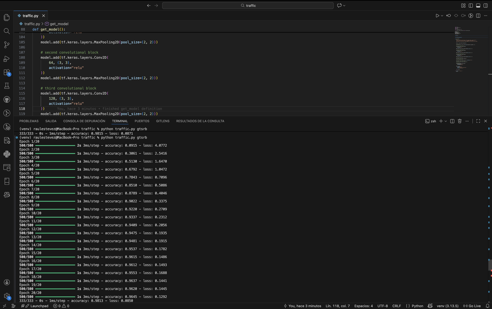

# Traffic

This project is part of the course **CS50's Introduction to Artificial Intelligence with Python**, within the unit on **Neural Networks**.  
The objective of this exercise is to build and train a convolutional neural network (CNN) capable of classifying traffic signs using image data.

## Project Description

Traffic sign recognition is a classic computer vision problem in artificial intelligence. In this project, a neural network is trained to identify traffic signs from the **German Traffic Sign Recognition Benchmark (GTSRB)** dataset.

Each image represents a traffic sign and belongs to one of **43 different categories**. The goal is to correctly classify each image based on its visual features, such as shapes, colors, and patterns.

The project focuses on designing, training, and evaluating a convolutional neural network using **TensorFlow and Keras**, as well as experimenting with different model configurations to improve performance.

## How It Works

The program consists of three main stages:

1. **Data Loading and Preprocessing**
   - Images are loaded from category-based directories.
   - Each image is resized to **30 × 30 pixels**.
   - Labels are assigned based on the directory name.
   - The dataset is split into training and testing sets.

2. **Model Architecture**
   - A convolutional neural network with multiple convolutional and pooling layers.
   - A fully connected layer to combine learned features.
   - A dropout layer to reduce overfitting.
   - A softmax output layer with one unit per traffic sign category.

3. **Training and Evaluation**
   - The model is trained for a fixed number of epochs.
   - Accuracy and loss are monitored during training.
   - Final performance is evaluated using a separate test set.

## Experimentation Process

Several experiments were conducted to improve the model:

- The number of training epochs was increased from 10 to 20, which significantly improved test accuracy.
- A Dropout layer was added to reduce overfitting and improve generalization.
- The size of the fully connected layer was adjusted to evaluate its impact on performance.
- An additional convolutional layer was tested to increase model depth.

After comparing results across multiple runs, the final model achieved **stable test accuracy of approximately 98%**, offering a good balance between performance, complexity, and consistency.

## How to Run

It is **recommended to use a Python virtual environment** to avoid dependency conflicts.

Once the virtual environment is created and activated, install the required packages using the `requirements.txt` file included in the project:

```bash
pip install -r requirements.txt
```

### Dataset Setup

1. Download the GTSRB dataset from the following link:

```
https://cdn.cs50.net/ai/2023/x/projects/5/gtsrb.zip
```

2. Unzip the file and place the resulting **`gtsrb`** folder inside the project directory.

If the link above does not work, the dataset can also be found in the **Getting Started** section of the official project page:

```
https://cs50.harvard.edu/ai/projects/5/traffic/
```

### Execution

Once the dataset is in place, run the program with:

```bash
python traffic.py gtsrb
```

## Example Output

Below is an example of the training output (your results may vary slightly):

```text
Epoch 20/20
accuracy: 0.9645
loss: 0.1292

Test accuracy: 0.9813
Test loss: 0.0850
```



## Key Concepts Implemented

- Convolutional Neural Networks (CNNs)
- Image preprocessing and resizing
- Supervised learning with labeled data
- Model regularization using Dropout
- Performance evaluation using accuracy and loss

## Files

- **`traffic.py`** → Main program. Loads data, defines the neural network, trains the model, and evaluates performance.

## Direct Access

- [**View the source code**](./traffic.py)  
- [Back to main README](../../README_en.md)

## Author

This project was completed by [**Raul Estevez**](https://raulesteveza.github.io) as part of the CS50 AI course assignments.
