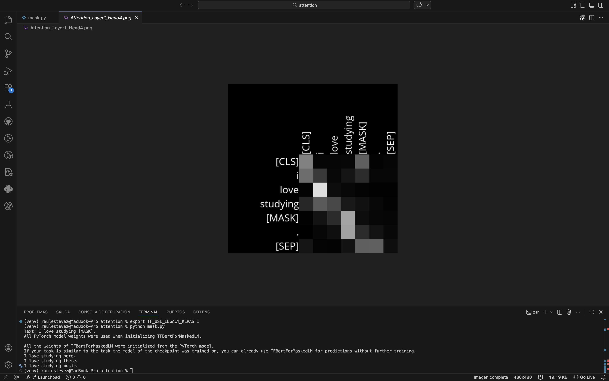

# Attention

Este proyecto forma parte del curso **CS50's Introduction to Artificial Intelligence with Python**, dentro de la unidad de **Language** (Procesamiento del Lenguaje Natural).

El objetivo de este ejercicio es analizar y visualizar el mecanismo de **self-attention** utilizado por los modelos basados en transformers.

## Descripción del Proyecto

Modelos como BERT utilizan self-attention para evaluar la relación entre los tokens de una frase. Cada token puede asignar dinámicamente distintos niveles de importancia a otros tokens, permitiendo al modelo capturar dependencias contextuales sin depender únicamente del procesamiento secuencial.

En este proyecto, los pesos de atención se extraen de un modelo BERT preentrenado y se representan como diagramas en escala de grises. Estas visualizaciones permiten observar cómo el modelo distribuye su atención en diferentes capas y heads.

## Funcionamiento

El programa opera en varias etapas:

1. **Procesamiento de Entrada**
   - El usuario introduce una frase que contiene el token `[MASK]`.
   - La frase se tokeniza utilizando un tokenizer preentrenado.

2. **Inferencia del Modelo**
   - Se carga un modelo BERT masked language model preentrenado.
   - El modelo genera matrices de atención para cada capa y head.

3. **Visualización de Atenciones**
   - Los valores de atención se convierten en tonos de gris.
   - Se genera un diagrama por cada capa y head de atención.

## Cómo Ejecutarlo

Se recomienda utilizar un **entorno virtual de Python** para evitar conflictos de dependencias.

Crear y activar el entorno virtual:

python3 -m venv venv
source venv/bin/activate

Instalar dependencias:

pip install -r requirements.txt

Si se ejecuta en macOS y aparecen problemas de compatibilidad con TensorFlow/Keras:

export TF_USE_LEGACY_KERAS=1

### Ejecución

Ejecutar el programa y proporcionar una frase cuando se solicite:

python mask.py

Ejemplo de entrada:

Text: La capital de Francia es [MASK].

## Salida

El programa genera múltiples archivos PNG que representan los patrones de atención:

- `Attention_LayerX_HeadY.png`

Cada imagen corresponde a una capa del transformer y a un head de atención. Las celdas más claras representan mayores valores de atención, mientras que las más oscuras indican menor atención.

## Conceptos Clave Implementados

- Mecanismo de self-attention
- Arquitectura transformer
- Capas y heads de atención
- Relaciones entre tokens
- Interpretación visual de matrices de atención

## Archivos

mask.py → Programa principal  
requirements.txt → Dependencias del proyecto

## Autor

Raul Estevez
